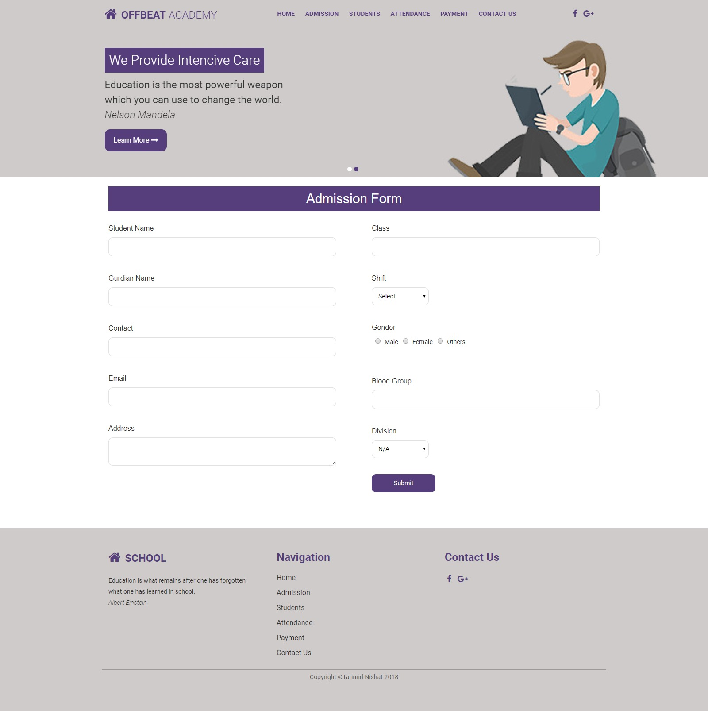
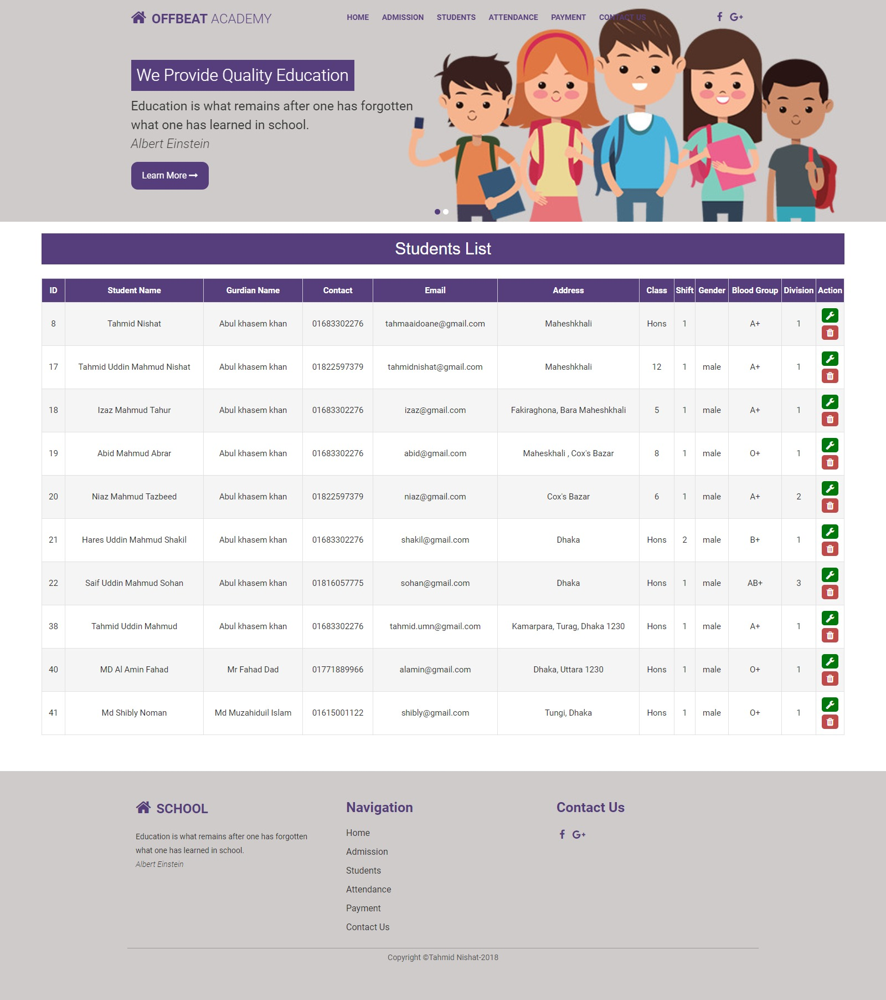

# 🎓 Student Management System

A robust and user-friendly Student Management System designed to handle student records efficiently. This full-stack application allows administrators to perform CRUD (Create, Read, Update, Delete) operations on student data seamlessly.

---

## ✨ Core Features

-   **Add New Students:** Easily add new students with details like name, class, roll number, and contact information.
-   **View All Students:** A clean, paginated table to view all student records at a glance.
-   **Search & Filter:** Instantly search for specific students by name or roll number.
-   **Update Student Info:** Edit and update student details with a simple click.
-   **Delete Students:** Securely remove student records from the database.
-   **Responsive Design:** Fully functional and visually appealing on both desktop and mobile devices.

---

## 🛠️ Technology Stack

This project is built using a modern and reliable tech stack:

-   **Backend:**
    -   **Framework:** Python (Flask / FastAPI)
    -   **Database:** PostgreSQL / SQLite
    -   **ORM:** SQLAlchemy
-   **Frontend:**
    -   **Framework/Library:** React.js / Vanilla JavaScript
    -   **Styling:** CSS3 / Bootstrap / Tailwind CSS
-   **Deployment:**
    -   **Backend:** Render / PythonAnywhere
    -   **Frontend:** Vercel / Netlify

---

## 📸 Application Screenshots

*(यहाँ अपने ऐप के 1-2 महत्वपूर्ण स्क्रीनशॉट डालें। जैसे 'All Students' टेबल और 'Add Student' फॉर्म का स्क्रीनशॉट।)*

**Dashboard View:**

**Add Student Form:**

---

## 🚀 How to Set Up and Run Locally

Follow these instructions to get the project up and running on your local machine.

### Prerequisites

-   Python 3.x
-   Node.js & npm (if using React)
-   Git

#

## 🏗️ API Endpoints

The backend provides the following RESTful API endpoints:

| Method | Endpoint          | Description                 |
| :----- | :---------------- | :-------------------------- |
| `GET`  | `/api/students`   | Get a list of all students. |
| `GET`  | `/api/students/`  | Get a single student by ID. |
| `POST` | `/api/students`   | Add a new student.          |
| `PUT`  | `/api/students/`  | Update an existing student. |
| `DELETE`| `/api/students/`| Delete a student.           |

---

## 🧑‍💻 Author

This project was crafted with passion by **Rameshwar Yadav**.

-   **GitHub:** [@rameshwaryadav](https://github.com/rameshwaryadav)
-   **LinkedIn:** [Your LinkedIn Profile](https://linkedin.com/in/rameshwar-dev)
-   ### 📸 Application Screenshots

**Main Dashboard - All Students List:**

**Add Student Form:**

